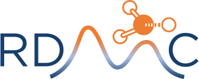

# Reaction Data and Molecular Conformer

[](https://xiaoruidong.github.io/RDMC/)
[](https://github.com/xiaoruiDong/RDMC/actions/workflows/ci.yaml)
[](https://codecov.io/gh/xiaoruiDong/RDMC)
[](https://anaconda.org/xiaoruidong/rdmc)
[](https://pypi.org/project/rdmc/)
[](http://opensource.org/licenses/MIT)

A light-weight software package with expertise in handling Reaction Data and Molecular (including transitions states) Conformers.

## Installation
The package can be easily installed with conda or mamba with

```
conda install -c xiaoruidong rdmc
```

You can also install RDMC from the source code:

```
git clone https://github.com/xiaoruidong/rdmc;
cd RDMC;
conda env create -f environment.yml;
conda activate rdmc;
python -m pip install -e --no-deps -vv ./;
```

There are two major modules in RDMC:
## ``rdtools``

It has a collections of functions that can be directly operated on to RDKit native objects. Most of them can be regarded as a modified version of a RDKit native operation but with simplified
imports, more intuitive usage, and more robustness implementation. They are distributed in submodules, each named by its relevance field and objects. It is best used in cases where efficiency is a
major conern and the task you required is relatively simple. Here are some highlights in ``rdtools``:

- viewers in ``rdtools.view``. These viewers greatly extend RDKit's default Ipython 3D viewer, with the capability of viewing animations and interaction with conformers.
- ``generate_resonance_structures`` in ``rdtools.resonance`` is able to generate resonance structures for radical molecules that is not capable by the original RDKit.
- ``mol_from_smiles`` in ``rdtools.conversion`` make sure the created molecule has an atom ordering consistent with the atom mapping
- ``mol_from_xyz`` supports two backends ``openbabel`` as well as ``xyz2mol`` for molecule connectivity perception. If both native backends fail (e.g., cannot be sanitized, or wrong charge or multiplicity), ``rdtools`` also provided a heuristic fix tool ``fix_mol`` in ``rdtools.fix`` to help fix the molecules if possible.


## ``rdmc``
It can be regarded as a midware between RDKit/``rdtools`` basic operations and complicated workflows. ``Mol`` (Previously, ``RDKitMol``) and ``Reaction`` are the most important classes.

- ``Mol`` (known as ``RDKitMol`` previously) is a child class of ``RWMol``, which means that you can directly use it with RDKit's native functions, but also integrated a lot of tools in ``rdtools``, so you can directly use them as class methods. The appended methods not only provides convenience in usage, but also make sure the output molecule objects, if applicable, is still a ``rdmc.Mol`` object. While many RDKit functions will just output ``Chem.Mol`` which is no longer editable, breaking the flow of your molecule operations.
- ``Reaction`` provides intuitive APIs for getting bond analysis, reaction comparison, visualization, etc.

For detailed APIs, please check the [documentation](https://xiaoruidong.github.io/RDMC/).

## Demos
Feel free to check demos in the `ipython/`, some of them are also available on the Google Colab:
- [Generate Atom Map for Reactions](https://colab.research.google.com/drive/19opX3Sr4R24o9n8f1o4LMSqlVIwN83xk?usp=sharing)
- [Handle molecule from/to XYZ](https://colab.research.google.com/drive/1QbmdvUMQqByPBDQVW7xTlp2rXg9EJ2_J?usp=sharing)
- [Parse QM Results](https://colab.research.google.com/drive/1JnTzETOGE3R3Q_foOLsnFgeN883J36dl?usp=sharing)

## Requirements
- To use ``rdtools``, you only needs ``numpy`` and ``rdkit`` at minimum. You can install optional dependencies: ``scipy`` for better resonance structure generation for polycyclic molecules, ``py3dmol`` to use the amazing 3D viewers, ``openbabel`` to extend `rdmc`'s xyz perception cability.
- To use ``rdmc``, the dependencies are basically the same as ``rdtools``, but we do recommend installing all optional dependencies for a better experience. Besides, to plot curves and figures for data, you can install ``matplotlib``; to play around with the log parsers you should consider install ``cclib`` and ``ipywidgets``. And to start computations in ``conformer_generation``, you need to have ``xtb`` and ``orca`` (which are free to academia) installed to get some serious results.

